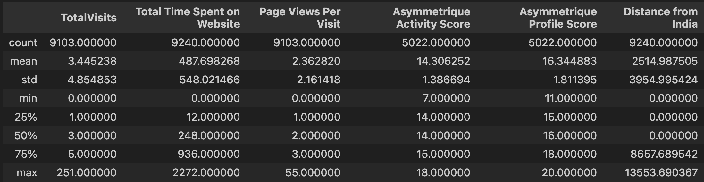

## Random Forest Implementation - Tensorflow
### Project #3

Used Autogluon to predict Lead Conversion. The output is both a binary conversion (0 or 1) or a probability to convert that goes from 0 to 1, which represents the probabilty for class 1, being more susceptible to real world use cases.

Used data exploration to creating a new feature "Distance from India" which helped to achieved 95% of accuracy on a dataset of 9000+ inputs.

## Context

X Education, an online education company, aims to predict which potential customers (leads) are most likely to purchase their courses. This project uses a dataset from Kaggle ([https://www.kaggle.com/datasets/amritachatterjee09/lead-scoring-dataset](https://www.kaggle.com/datasets/amritachatterjee09/lead-scoring-dataset)) to build a predictive model.

## Data Analysis and Preparation

1. ## Categorical Data:
   - The `Country` feature was analyzed, revealing that over 90% of leads were from India, suggesting the company's primary market.
   - A new numerical feature, `Distance from India`, was created using latitude and longitude data from the `CountryInfo` and `GeoPy` libraries.
   - Contingency matrices and Cramer's V were used to assess the relationship between categorical features and the target variable (`Converted`).

2. ## Numerical Data:
   - Boxplots were used to visualize the distribution of numerical features and identify potential outliers.

3. ## Correlation:
   - Cramer's V values for categorical features and Pearson correlation coefficients for numerical features were combined to create a comprehensive correlation matrix.

## Model Building and Prediction

- Feature Selection: All features were used for model training, given the sufficient number of data points relative to the number of features.
- Model Training: AutoGluon's `WeightedEnsemble_L2` model achieved the best performance on an 80/20 train-test split.

## Results and Conclusion

- Model Performance: The model achieved an accuracy of 95%.
- Feature Importance: The new `Distance from India` feature, while having a minor impact on overall accuracy, was ranked 8th in importance.
- Practical Application: A `Conversion Prob` column was added to provide the probability of conversion for each lead, enhancing the model's real-world usability.

## Key Metrics:

* Accuracy: 95%
* Other relevant metrics (precision, recall, F1-score, etc.) can be included here based on your model's output.

## Images

* [Image 1] - Bar plot of `Country` distribution
* [Image 2 & 3] - Boxplots of numerical features
* [Image 4] - Correlation matrix
* [Image 5 & 6] - Feature importance plots
* [Image 7 & 8] - Model performance metrics